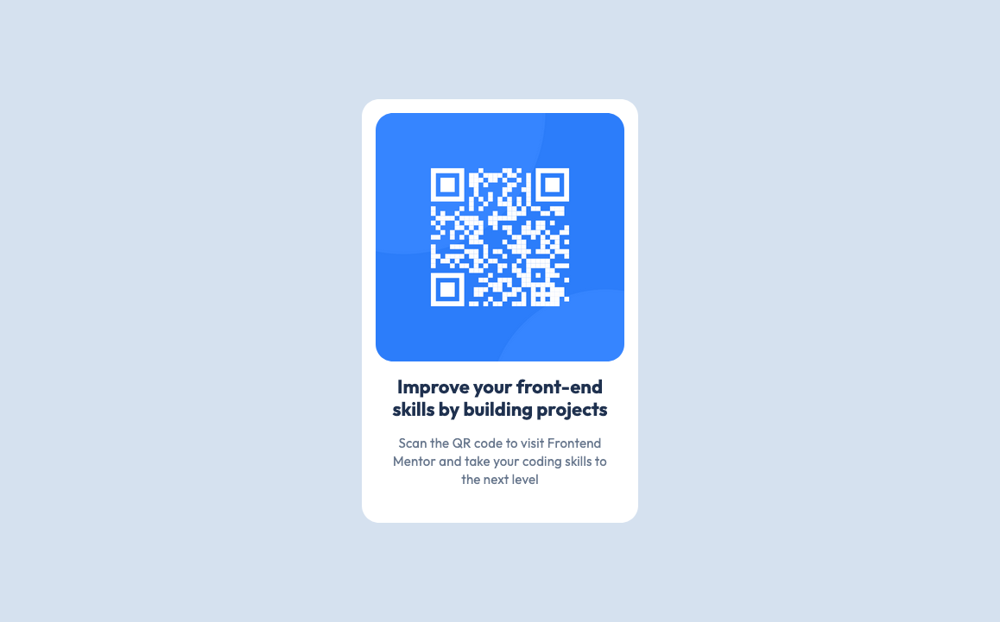

# Frontend Mentor - QR code component solution

This is a solution to the [QR code component challenge on Frontend Mentor](https://www.frontendmentor.io/challenges/qr-code-component-iux_sIO_H). Frontend Mentor challenges help you improve your coding skills by building realistic projects.

## Table of contents

- [Overview](#overview)
  - [Screenshot](#screenshot)
  - [Links](#links)
- [My process](#my-process)
  - [Built with](#built-with)
- [Author](#author)
- [How to Run](#how-to-run)

## Overview

### Screenshot

### Links

- Solution URL: [Repo](https://github.com/ivantisera/fm-01-qrcode.git)
- Live Site URL: [Live site on Github Pages](https://ivantisera.github.io/fm-01-qrcode/)

## My process

### Built with

- Semantic HTML5 markup
- CSS custom properties for design tokens (colors, spacing)
- Flexbox for layout and alignment
- CSS Grid for structured component layout
- Mobile-first workflow
- Responsive design using viewport units (vw, vh) y min-height
- Font loading con Google Fonts (Outfit)
- Utility-first spacing system con variables (--spacing-200, etc.)
- Accessibility: Semantic HTML and meaningful alt text for better screen reader support

## Author

Iván Tisera

## How to run

🚀 Just open index.html in your browser.
